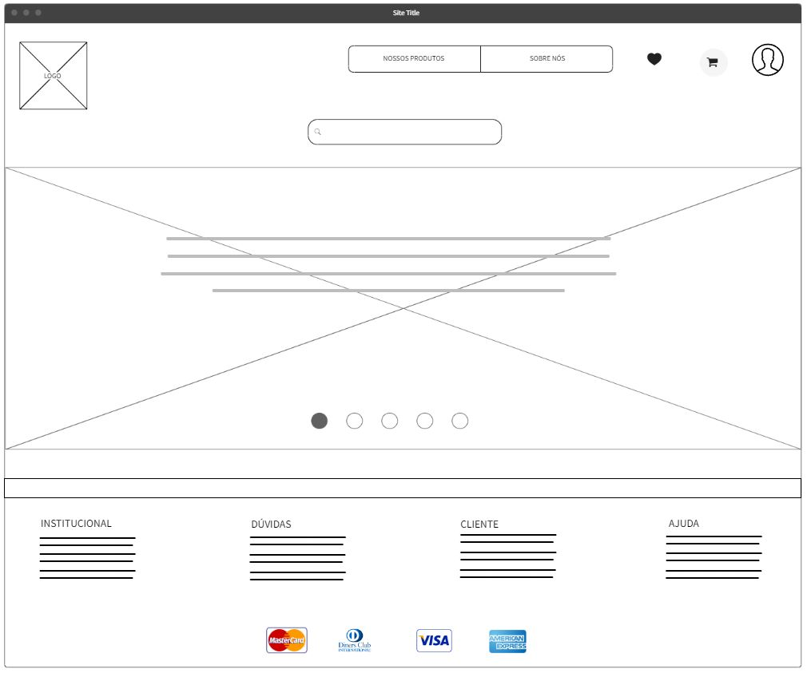

# Happy-Cake



> Status: Developing ⚠️

<h2 align="center"> 🛠 Technologies Used: </h2>
<table align="center">
    <tr>
        <td>HTML</td>
        <td>CSS</td>
        <td>JavaScript</td>
        <td>Git</td>
    </tr>
<table>

---

<h2 align="center"> 🤓 Contato</h2> 
<p align="center">reynanwq@gmail.com</p>

---

<h2 align="center">Como Contribuir 💪</h2>

   ```
   - Fork o projeto 

   - Cria uma nova branch com suas mudanças:
   $ git checkout -b my-feature

   - Salve suas mudanças e crie uma mensagem de commit falando o que fez:
   $ git commit -m "feature: My new feature"

   - Envie suas mudanças:
   $ git push origin my-feature
   ```

---
